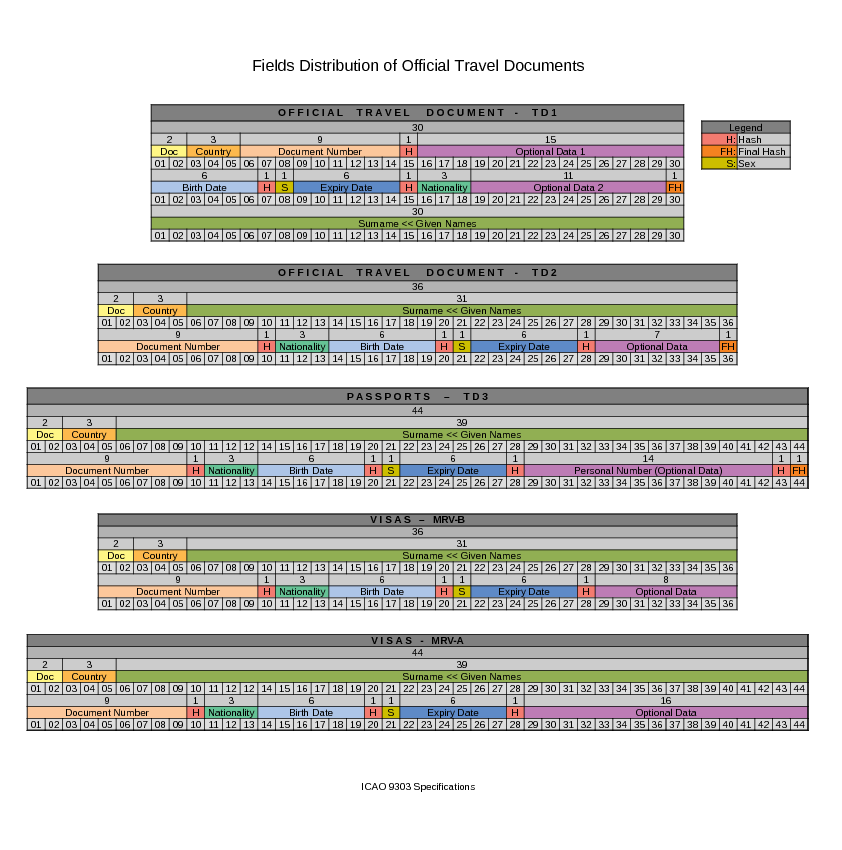

# Mrzilian.js


## Description

Machine Readable Zone generator and checker for official travel documents sizes
1, 2, 3, MRVA and MRVB (Passports, Visas, national id cards and other travel documents)

MRZ Generator and MRZ Checker are built according to International Civil Aviation
Organization specifications (ICAO 9303):

* [Specifications Common to all Machine Readable Travel Documents (MRTDs)](https://www.icao.int/publications/Documents/9303_p3_cons_en.pdf)
* [Specifications for Machine Readable Passports (MRPs)](https://www.icao.int/publications/Documents/9303_p4_cons_en.pdf)
* [Specifications for TD1 Size Machine Readable Official Travel Documents (MROTDs)](https://www.icao.int/publications/Documents/9303_p5_cons_en.pdf)
* [Specifications for TD2 Size Machine Readable Official Travel Documents (MROTDs)](https://www.icao.int/publications/Documents/9303_p6_cons_en.pdf)
* [Specifications for Machine Readable Visas (MRV)](https://www.icao.int/publications/Documents/9303_p7_cons_en.pdf)

## Fields Distribution of Official Travel Documents



## Usage

````js
const document = new TD1Document(
    "ID",
    "MOZ",
    "50012",
    "M",
    "Keven José Manuel",
    "Gonçalves",
    "24/04/2002",
    "31/05/2027",
    "MOZ",
    "DA",
    "12"
) 

const generator = new TD1Generator(document)
console.log(generator)

const mrz = "IDMOZ50012M<<<<<<<<<<<<<<<\n50012<DA<12<<<<<<<<<<<<<<<<<";
const checker = TD1Checker(mrz, false)
checker.check()
``````

TODO:

* [ ] Add Tests
* [ ] Better Refactoring
* [ ] Better Characters Normalization
* [ ] Better Documentation

---
Thanks to [Arg0s1080](https://github.com/Arg0s1080) for the comprehension about MRZ
